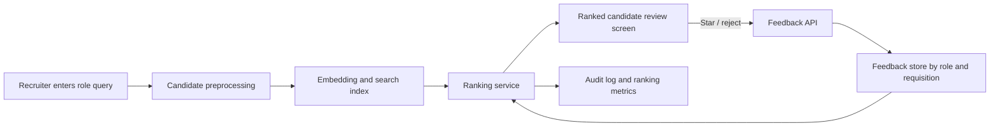

# Potential Talent: Candidate Ranking and Relevance Feedback

This repository contains an exploratory natural language processing workflow for ranking candidate profiles against a recruiting query. It addresses the **Potential Talents** project brief through text preprocessing, multiple document-representation methods, cosine-similarity ranking, and a prototype relevance-feedback mechanism based on recruiter stars and rejections.

The repository demonstrates the modeling logic in a Jupyter notebook. It does **not** contain a deployed recruiter-facing application, production API, persistent feedback database, or a validated probability-of-fit model.

## Problem definition

The project brief describes a recruiting workflow with three requirements:

1. Accept a role-specific search phrase, such as **"aspiring human resources"**.
2. Rank sourced candidates by their estimated relevance to that phrase.
3. Treat a starred candidate as an example of the recruiter's preferred profile and re-rank the remaining candidates after each starring action.

Candidate sourcing is outside the project scope. The analytical task begins with an existing candidate list.

## Evidence from the supplied data

| Observation | Value |
| --- | ---: |
| Candidate records | 104 |
| Unique candidate IDs | 104 |
| Unique job-title strings | 52 |
| Duplicate job-title rows | 52 |
| Available `fit` labels | 0 of 104 |

The dataset contains the following fields:

| Field | Description |
| --- | --- |
| `id` | Unique candidate identifier |
| `job_title` | Candidate job-title text |
| `location` | Candidate location |
| `connection` | LinkedIn-style connection count |
| `fit` | Intended target score between 0 and 1 |

Because the `fit` column is entirely empty, the supplied data cannot support supervised training or an evidence-based evaluation of predicted fit probabilities. The notebook therefore treats candidate ranking as a **text-retrieval problem** and uses similarity scores as ranking signals rather than calibrated probabilities.

## Implementation status

| Capability | Status | Evidence in the repository |
| --- | --- | --- |
| Load and audit the source data | Implemented | Record counts, column types, and missing values are inspected |
| Remove duplicate job titles | Implemented | The corpus is reduced from 104 records to 52 distinct title strings |
| Clean and compare text variants | Implemented | Lowercasing, punctuation handling, token cleaning, and word-loss checks are included |
| Rank candidates from a query | Implemented in the notebook | Candidate and query vectors are compared with cosine similarity |
| Compare representation methods | Implemented | Bag of Words, TF-IDF, Word2Vec, GloVe, FastText, BERT, and SBERT are examined |
| Re-rank after recruiter feedback | Implemented as a notebook prototype | Starred and rejected candidates update the SBERT query representation |
| Predict a calibrated `fit` probability | Not implemented | No labeled `fit` values are available for training or validation |
| Recruiter-facing search and review system | Not implemented | No web interface, API, authentication, or deployment is included |
| Persistent feedback and audit history | Not implemented | Demonstration feedback is held in notebook memory |
| Validated filtering threshold | Not established | Relevance labels and cross-role evaluation data are required |
| Bias and fairness evaluation | Not established | The dataset is anonymized and contains no evaluation labels or protected-attribute audit set |

## Analytical workflow

```text
Recruiter query
      |
      v
Text cleaning and tokenization
      |
      v
Document representation
(BoW / TF-IDF / embeddings)
      |
      v
Cosine similarity
      |
      v
Initial candidate ranking
      |
      v
Recruiter stars or rejects candidates
      |
      v
Query representation is updated
      |
      v
Candidate list is re-ranked
```

## Representation methods

| Method | Representation | Role in the analysis |
| --- | --- | --- |
| Bag of Words | Sparse token counts | Transparent lexical baseline |
| TF-IDF | Weighted sparse token counts | Reduces the influence of common corpus terms |
| Word2Vec | Dense word embeddings | Demonstrates local context learning |
| GloVe | Dense word embeddings | Demonstrates global co-occurrence learning |
| FastText | Word and character n-gram embeddings | Adds subword information |
| BERT | Contextual token embeddings with mean pooling | Demonstrates contextual encoding |
| SBERT | Pretrained sentence embeddings | Semantic-ranking baseline and feedback representation |

The Word2Vec, GloVe, and FastText sections are educational local implementations. A corpus of 52 unique titles is too small to train reliable general-purpose word embeddings. Pretrained SBERT is better suited to the sentence-level comparison used in this experiment.

## Similarity ranking

For a query vector (q) and candidate vector (c), cosine similarity is calculated as:

```text
cos(q, c) = (q dot c) / (||q|| ||c||)
```

Higher scores indicate that the two vectors point in more similar directions. These values are useful for ordering candidates within a method, but they are **not probabilities of candidate fitness** and should not be compared as equivalent confidence values across different models.

## Recruiter-feedback prototype

The notebook interprets a star as **"find more candidates similar to this profile"** rather than only increasing the selected row's score. It also supports optional rejection feedback.

```text
q' = normalize(
       0.60 * original_query
     + 0.40 * mean(starred_candidates)
     - 0.15 * mean(rejected_candidates)
)

final_score = cosine(candidate, q') + 0.03 * is_starred
```

The notebook:

- validates candidate IDs;
- prevents the same candidate from being both starred and rejected;
- recalculates every candidate's similarity after feedback;
- reports initial rank, updated rank, and rank change;
- demonstrates sequential feedback with candidates 72 and 76; and
- keeps feedback separated by search query in an in-memory dictionary.

The coefficients are prototype choices, not learned parameters. They require validation against recruiter judgments before operational use.

## Recruiter system still required

A usable recruitment tool would need to place the notebook logic behind an application layer. The following architecture is a proposed next stage and is **not included in this repository**:



A production implementation should include:

- a search and ranked-results interface;
- an API for queries, stars, rejections, and re-ranking;
- persistent feedback scoped to each role or requisition;
- a versioned embedding index and reproducible model configuration;
- an audit trail showing why ranks changed;
- labeled recruiter judgments for Precision@K, Recall@K, MAP, and NDCG;
- threshold and abstention testing across multiple job families;
- bias monitoring, human review, and restrictions against using protected attributes as ranking signals; and
- access controls, privacy safeguards, and retention rules for candidate information.

## Repository contents

- `potential talent.ipynb` — data audit, preprocessing, vectorization, ranking, model comparison, and feedback demonstration.
- `potential-talents.xlsx` — anonymized candidate records used by the notebook.

## Reproducing the notebook

### 1. Clone the repository

```powershell
git clone https://github.com/Abdulrahmanos/b8tUOOf3Y4MCGYy4.git
cd b8tUOOf3Y4MCGYy4
```

### 2. Create and activate a virtual environment

Python 3.11 or 3.12 is recommended.

```powershell
python -m venv .venv
.\.venv\Scripts\Activate.ps1
```

### 3. Install dependencies

```powershell
python -m pip install jupyter pandas numpy matplotlib scikit-learn openpyxl torch transformers sentence-transformers
```

### 4. Open the notebook

```powershell
jupyter lab "potential talent.ipynb"
```

Run the cells from top to bottom. The BERT and SBERT sections download pretrained models on their first execution and therefore require an internet connection.

## Interpretation

The repository establishes a transparent lexical baseline, compares it with several embedding approaches, and demonstrates how recruiter feedback can alter a semantic ranking. It provides a defensible prototype of the ranking logic requested in the project brief.

It does not establish that the rankings improve hiring outcomes, predict a calibrated fitness probability, generalize to other roles, or reduce human bias. Those claims require labeled relevance data, ranking metrics, cross-role testing, and a recruiter-facing system that records feedback consistently.
